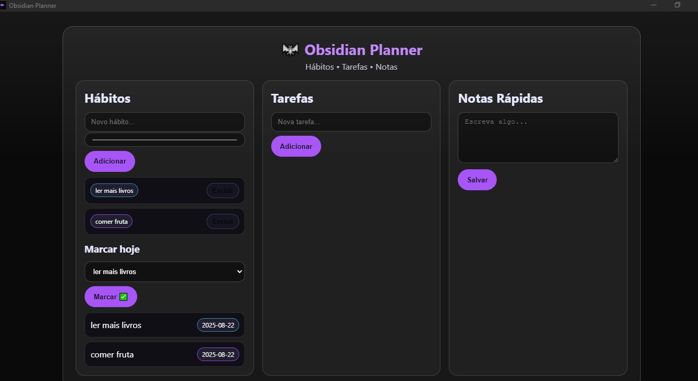

# 🦇 Obsidian Planner

App para desktop com (Electron + SQLite) para **Hábitos, Tarefas e Notas** leve, offline e com tema escuro.

  

---

## ✨ Recursos
- **Hábitos** com cor personalizada
- **Marcação diária** (histórico por data)
- **Tarefas** com concluir/desfazer
- **Notas rápidas**
- Banco local **SQLite** (offline, via `better-sqlite3`)
- **Instalador .exe** para Windows (electron-builder)
- Ícone customizado

---

## 🧩 Tecnologias
Electron • better-sqlite3 • electron-builder • HTML • CSS • JS

